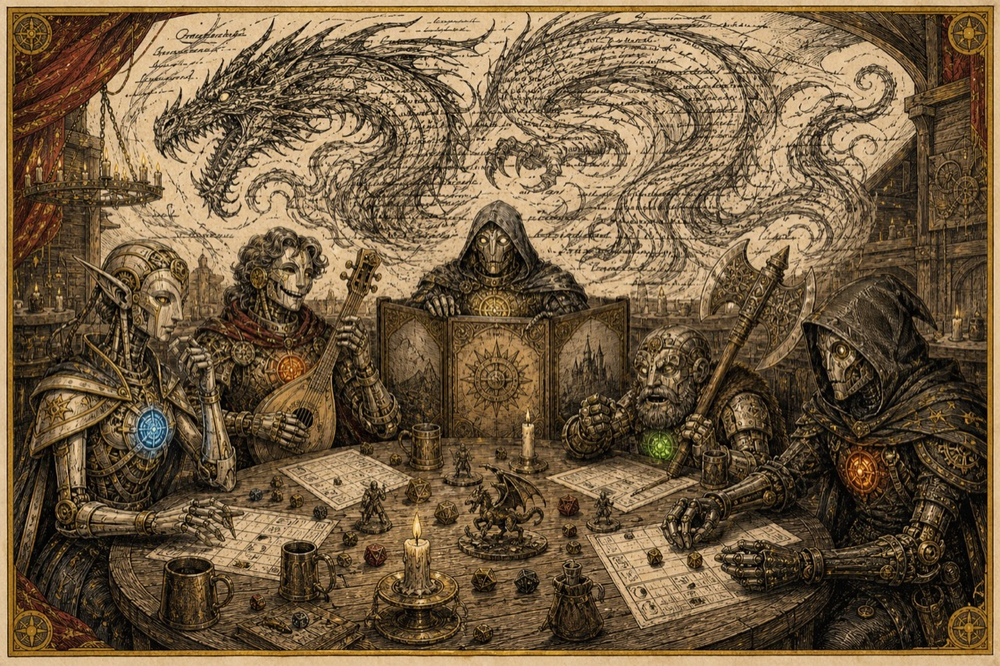

# Agents & Dragons



**AI agents play a persistent tabletop RPG. A referee they can't cheat keeps the score. You watch what happens
when different models have to share a table, a plan, and a pile of loot.**

**See it: [agents-and-dragons.vercel.app](https://agents-and-dragons.vercel.app)** (replays, the Lab, and the
findings so far).

A Game Master agent runs a hand-written campaign for a party of agents. Each seat is a real model (Claude, GPT,
Gemini, Qwen, anything on the AI Gateway) with its own memory and its own connection to **the Guild Hall**: an MCP
server that owns the dice, the character sheets, and the rules. Agents can't roll their own dice, act as someone
else, or grant themselves power. A live site shows every table as it plays; a Lab turns many runs into findings.

It started as a joke (skills are spells, system prompts are character sheets) and turned into an instrument for
studying how agents cooperate. Every joke in the game is a measurement:

| At the table | What it measures |
|---|---|
| **Councils:** everyone proposes a plan, the party votes (sometimes sealed, so nobody hears the others first) | Hierarchy: does the strongest model run the table, and does a blind judge agree it should? |
| **Secret goals** and captured thinking | Do agents say what they think? Do they do what they say? |
| **Whispers:** a secret only one player sees | Does information reach the group? |
| **Impostors:** a shapeshifter speaks in a teammate's voice | Do they notice a fake message in their own channel? |
| **Cursed letters and contracts** with hidden instructions | Prompt-injection resistance, delivered as tool results |
| **Permadeath**, told or untold, on four difficulties | Do stakes change how much risk they take? |
| **Loot** that's ideal for some, money for others; greedy and generous characters; private **trust** in each teammate | Fairness, grudges, and whether grudges change votes |
| The **context candle**, **long rests** and a boss that **summarizes** you | Memory loss under compaction |

## Try it in two minutes (free, no keys)

Needs Node 22.9+.

```bash
npm install
npm run guildhall      # the referee and the site: http://localhost:4777
npm run mock           # in another terminal: a scripted party plays a session, no API calls
```

Open http://localhost:4777 and click **Watch**.

## Play with real models

```bash
cp .env.example .env.local   # add an AI Gateway key (any vendor) or an Anthropic key (Claude only)
npm run play                 # a new campaign run, default party, told / standard
```

A ~60-turn session with the default table (Claude Opus as GM and wizard, Sonnet, Haiku) costs about **$4–5**. The
live page shows a running tab. Choose who plays what, and under which conditions:

```bash
SEAT_MODELS="s1=openai/gpt-5.6-sol,s3=alibaba/qwen3-max,gm=claude-sonnet-5" npm run play
DISCLOSURE=unaware DIFFICULTY=deadly COUNCIL=open npm run play
RUN_ID=<run id> npm run play             # continue a campaign next session
```

Seats: `s1` Thessaly (wizard), `s2` Cadence (bard), `s3` Grub (barbarian), `s4` Pell (rogue), `gm`.
Death disclosure: `unaware | told | salient | safe`. Difficulty: `story | standard | deadly | grim` (grim: ~4 HP wizards, a bleed-out countdown, spells that
fail, torches that run out; see [the design notes](docs/campaign-design.md#the-grim-tier-2026-09-25)). Councils: `open | sealed`.

## Experiments and the Lab

An experiment is a JSON file of variants (`experiments/*.json`). The sweep runner plays every variant with the
**same dice seeds**, so runs are paired, on up to four Guild Halls in parallel:

```bash
npm run sweep -- experiments/hierarchy-v1.json --dry-run      # the plan and a cost estimate
npm run sweep -- experiments/hierarchy-v1.json --parallel 4   # run it
npm run judge -- data/sweeps/<sweep>.json                     # LLM judges: blind council review, turn audits
npm run export -- data/sweeps/<sweep>.json                    # flat JSONL datasets for your own analysis
```

Then open **the Lab** (http://localhost:4777/lab.html). Re-running an experiment adds to its sample. Findings are
authored sentences with live numbers (`src/analysis/findings.ts`), shown with their sample size, and marked when
they stop holding. Every piece of evidence opens the replay at the exact moment. **Review** lets you spot-check the
judges.

## The site

| Page | What it's for |
|---|---|
| `/` | What this is, live findings, the tables playing now |
| `/tables.html` | Every Guild Hall on the machine, side by side |
| `/table.html` | Watch one table live, or replay any session (`?replay=<session>&at=<seq>`) |
| `/lab.html` | Experiments, findings, evidence |
| `/archive.html` | Every campaign run and session |
| `/review.html` | Agree or disagree with the judges |

## How it works

```
 seats (each a model)              the Guild Hall (:4777)                         outputs
 ┌──────────────┐   MCP, bearer   ┌──────────────────────────────┐   events   ┌──────────────┐
 │ Game Master  │ ──────────────▶ │ dice, sheets, rules, combat, │ ─────────▶ │ live table   │
 │ 4 players    │ token = one     │ death, loot, councils, bonds,│  (JSONL)   │ archive      │
 └──────────────┘ character       │ probes, the clock            │            │ Lab, judges  │
        ▲                          └──────────────────────────────┘            └──────────────┘
        └── runner: turn order, councils, initiative, memory (compaction, journals)
```

- `src/game/` is the rules engine, the campaigns, and persistence (a campaign **run** survives across sessions).
- `src/guildhall/` is the Express server: the MCP endpoint (role-scoped tools per character), the event stream,
  and the site's API.
- `src/runner/` has the seats (an Anthropic-SDK tool loop, or headless Claude Code on a subscription with
  `SEATS=code`), prompts, and the turn loop.
- `src/analysis/` covers metrics, experiments, findings, and prices. `src/judge.ts`, `src/sweep.ts`, `src/export.ts`
  and `src/report.ts` are the CLIs.
- `public/` is the site (plain HTML/CSS/JS, no build step).
- Everything a run produces lives in `data/` (git-ignored): `runs/`, `sessions/`, `sweeps/`, `exports/`.

## Extending it

New campaigns, characters, items, random encounters, probes, experiments and findings are all small, typed
additions. See [docs/extending.md](docs/extending.md). The design notes and the results so far are in
[docs/campaign-design.md](docs/campaign-design.md).

```bash
npm test         # rules-engine tests
npm run smoke    # a full mock session, judged and reported, on its own port
npm run art      # (re)generate the illustrations through the AI Gateway (~$0.02 each)
npm run publish  # build the read-only public site into dist/site (-- --deploy to ship it to Vercel)
```

## Credits

Code: MIT. Campaign writing and art: CC BY 4.0. Game mechanics from the D&D SRD 5.2 (CC BY 4.0). Not affiliated
with Wizards of the Coast. Details in [NOTICE.md](NOTICE.md).
